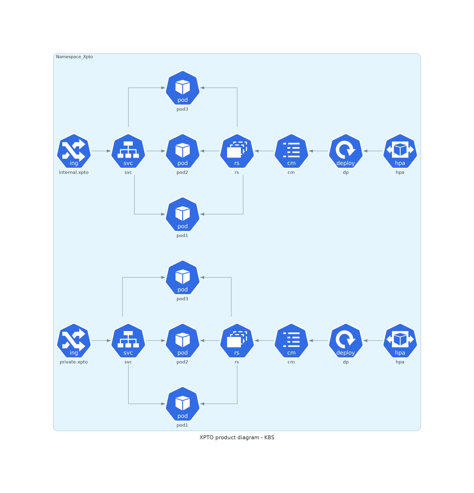
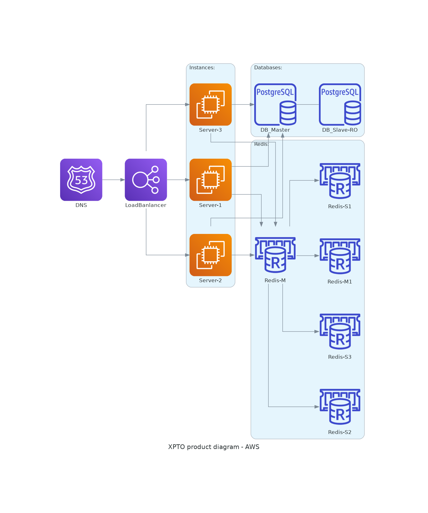

# Diagrams - Diagrams as Code

## Objetivo
Estudar a usuabilidade e aplicabilidade da ferramenta.

## Montando o ambiente
Esta solução está disponível em duas linguagens diferentes.
1. GO Lang
2. Python

Optei em usar em cima do Python.

### Dependências
Software Graphviz e os módulos do Diagrams

#### Instalando o Graphviz
Ubuntu/Debian:
```
sudo apt-get install graphviz
```
Fedora/RedHat/Centos
```
sudo yum install graphviz
```

Bsd/Mac
```
sudo port install graphviz
brew install graphviz
```

#### Instalando os módulos do Diagrams
1. Opção:
```
# using pip (pip3)
$ pip install diagrams
```
2. Opção:
```
# using pipenv
$ pipenv install diagrams
```

3. Opção:
```
# using poetry
$ poetry add diagrams
```
## Demonstração
### Exemplos

#### Diagrama de aplicação em Kubernetes
[exemplo-k8s.py](https://www.example.com)
Este código serve como modelo de um caso fictício baseado em um ambiente Kubernetes.
Neste exemplo foi adicionado alguns serviços interligados na entrega.



#### Diagrama de aplicação em AWS
[exemplo-LB-EC2-RDS-Redis.py](https://www.example.com)
Este código serve como modelo de um caso fictício baseado em um ambiente AWS.
Neste exemplo foi adicionado alguns serviços interligados na entrega.


## Fontes
##### Página oficial
[Diagrams](https://https://diagrams.mingrammer.com/)
[Github](https://github.com/mingrammer/diagrams)

